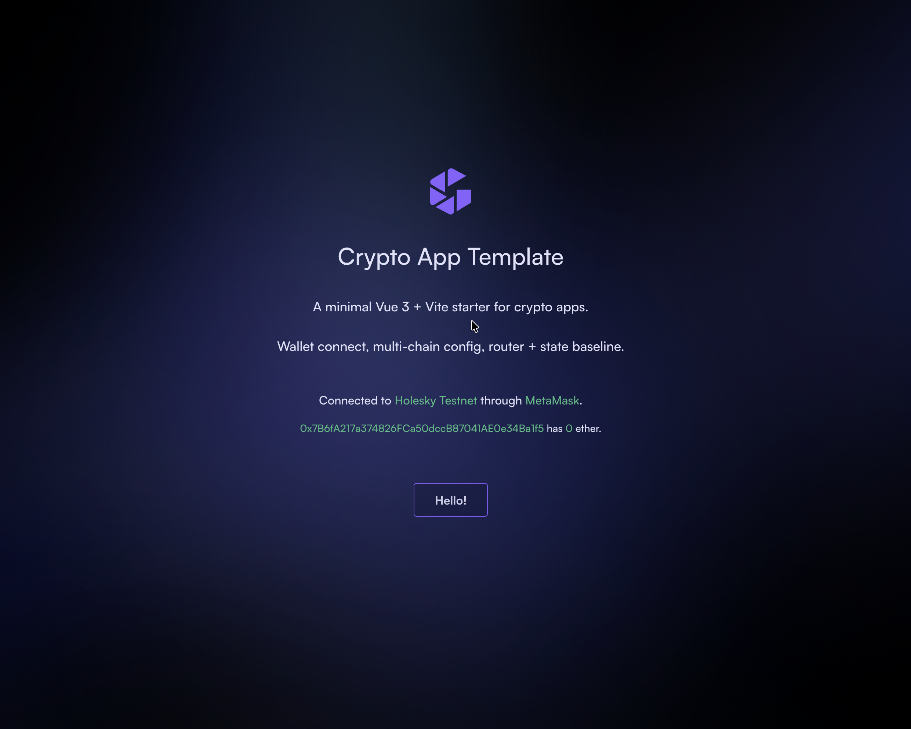

# vue-crypto-app-template

A minimal Vue 3 + Vite starter for crypto / web3 apps. Wallet connect, multi-chain config, and a router/state baseline — drop in your contract calls and ship.



## What's inside

- **Vue 3.5** + **Vite 8** with `<script setup>` SFCs
- **`@web3-onboard/core`** + injected-wallets for wallet connection (MetaMask, Rabby, etc.)
- **ethers v6** and **web3.js v4** both bundled — pick one per call
- **Pinia 3** store (`walletStore`) wrapping the onboard state
- **vue-router 5** with a chain-guard that pins `?chain=` to a configured chainId
- **vue-toastification** for transient UI feedback
- **bignumber.js 11** for safe on-chain math
- ESLint + Prettier configured for Vue SFCs
- No TypeScript, no JSX, no Webpack — keeps the boilerplate readable

See [`MIGRATION.md`](./MIGRATION.md) for the per-package version notes from the most recent dep bump.

## Quick start

```sh
bun install
bun run dev
```

Then open the URL Vite prints (usually `http://localhost:5173`).

## Configure your chains

Chain configs live in [`src/stores/walletStore/index.js`](./src/stores/walletStore/index.js) under `_chains`. The included examples are Holesky, Fuji, Avalanche C-Chain, and Ethereum Mainnet. Add or remove as needed:

```js
const _chains = {
  myChain: {
    id: "0x...",            // hex chainId
    token: "ETH",
    label: "My Chain",
    rpcUrl: "https://...",
  },
  // ...
}
```

- `_chains_default` sets the chain a fresh visitor lands on.
- `_chains_not_ready` lists chains that surface as "coming soon" but don't block connection.

## Wire wallet-onboard

The template runs without a Blocknative `apiKey`. To enable notify (transaction toast feed, per-wallet labels, etc.), grab a key at [explorer.blocknative.com](https://explorer.blocknative.com/account) and add it to the `Onboard({...})` call in `walletStore/index.js`:

```js
const onboard = Onboard({
  apiKey: "your-key-here",
  // ...
})
```

## Scripts

| Command | What it does |
|---|---|
| `bun run dev` | Vite dev server with HMR |
| `bun run build` | Production bundle into `dist/` |
| `bun run watch` | Production build that rebuilds on change |
| `bun run serve` | Serve a prebuilt `dist/` on localhost |
| `bun run preview` | Vite preview server (built bundle) |
| `bun run lint` | ESLint with `--fix` over `.vue`, `.js`, `.jsx`, `.cjs`, `.mjs` |
| `bun run pretty` | Prettier across the project |

## Recommended IDE

[VS Code](https://code.visualstudio.com/) + [Volar](https://marketplace.visualstudio.com/items?itemName=Vue.volar). Disable Vetur if you have it.

## Deploying to GitHub Pages

A workflow at `.github/workflows/pages.yml` builds and publishes to GitHub Pages on every push to `main`. To enable it on a fresh fork or template clone:

1. **Repo Settings → Pages → Source**: select **GitHub Actions**.
2. Push to `main` (or run the workflow manually from the Actions tab).

The site is served at `https://<user>.github.io/<repo>/`. The workflow exports `BASE_PATH=/<repo>/` so the Vite build picks up the right asset prefix on a per-fork basis — no manual edit to `vite.config.js` needed.

Two small additions in `vite.config.js` make it work end-to-end:

- `base` reads from `process.env.BASE_PATH` (defaults to `/` so local dev is unaffected).
- A tiny `spa-404-fallback` plugin copies `dist/index.html` to `dist/404.html` at the end of every build. The router uses HTML5 history mode (`createWebHistory`), so direct hits to non-root paths would 404 without this fallback.

## Using this as a template

This repo is set up as a GitHub Template. Click **Use this template** on the repo page, or:

```sh
gh repo create my-app --template gultekinmakif/vue-crypto-app-template --private --clone
```

## License

[MIT](./LICENSE).
